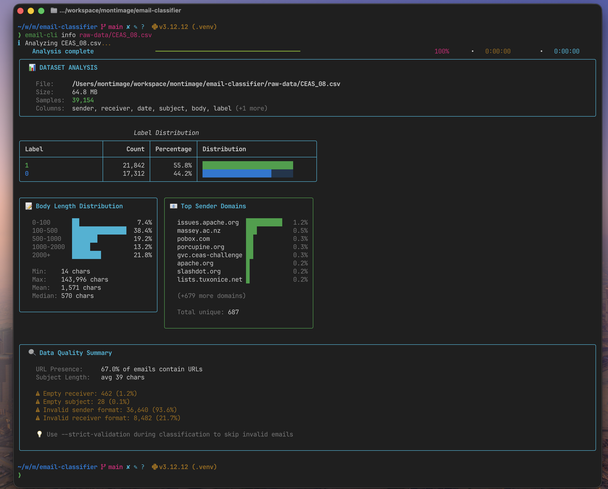
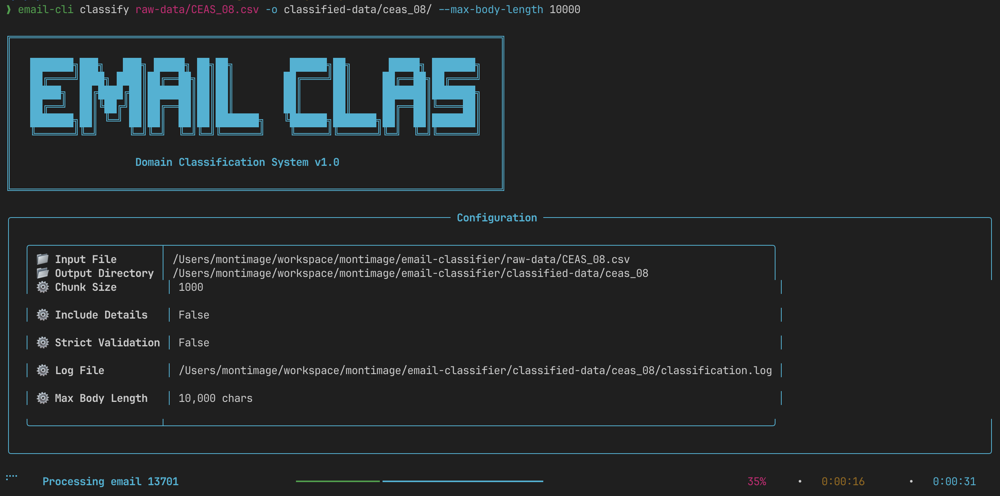
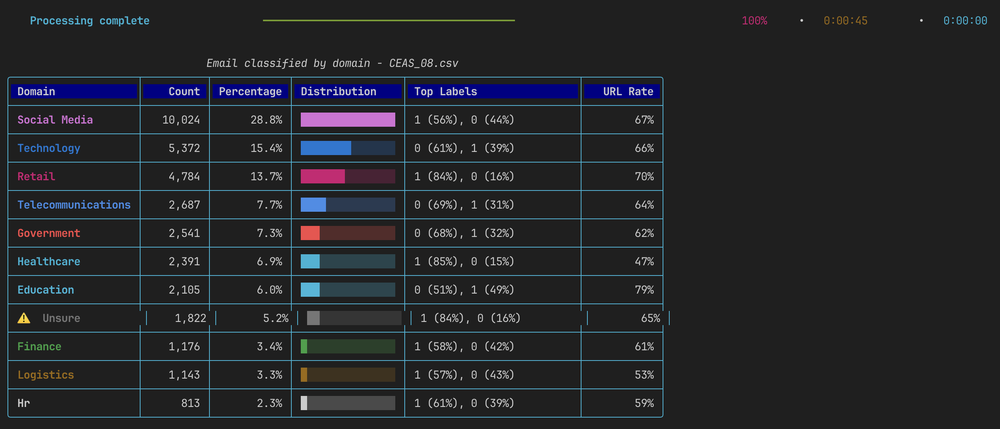

# Email Domain Classifier

[](https://github.com/montimage/email-domain-classifier/actions)
[](https://codecov.io/gh/montimage/email-domain-classifier)
[](https://badge.fury.io/py/email-domain-classifier)
[](https://pypi.org/project/email-domain-classifier/)
[](https://opensource.org/licenses/Apache-2.0)

A Python library for classifying emails by domain using dual-method validation. Designed for processing large datasets efficiently with streaming processing.

## Screenshots

### Dataset Analysis
Analyze your dataset before classification to understand label distribution, body lengths, and data quality:



### Classification in Progress
Real-time progress tracking with configuration display:



### Classification Results
Domain distribution table showing classification breakdown:



### Processing Summary
Detailed results with validation stats, performance metrics, and output files:


## Quick Start

```bash
# Install
git clone git@github.com:montimage/email-domain-classifier.git && cd email-domain-classifier
python -m venv .venv && source .venv/bin/activate
pip install -e .

# Analyze dataset
email-cli info sample_emails.csv

# Classify emails
email-cli sample_emails.csv -o output/
```

## Supported Domains

| Domain | Description |
|--------|-------------|
| Finance | Banking, payments, financial services |
| Technology | Software, hardware, IT services |
| Retail | E-commerce, shopping, consumer goods |
| Logistics | Shipping, supply chain, transportation |
| Healthcare | Medical services, health insurance |
| Government | Public sector, regulatory agencies |
| HR | Human resources, recruitment |
| Telecommunications | Phone, internet, communication services |
| Social Media | Social platforms, networking services |
| Education | Schools, universities, learning platforms |

## Module Structure

| Module | Description |
|--------|-------------|
| `email_classifier/analyzer.py` | Dataset analysis (info command) |
| `email_classifier/classifier.py` | Core classification logic |
| `email_classifier/cli.py` | Command-line interface |
| `email_classifier/domains.py` | Domain definitions and profiles |
| `email_classifier/processor.py` | CSV streaming processor |
| `email_classifier/reporter.py` | Report generation |
| `email_classifier/ui.py` | Terminal UI components |
| `email_classifier/validator.py` | Email validation |
| `tests/` | Test suite |
| `docs/` | Documentation |
| `raw-data/` | Sample input datasets (Git LFS) |
| `classified-data/` | Example classification outputs (Git LFS) |

## Example Data

The repository includes sample datasets for testing and reference:

**Input** (`raw-data/`):
- `CEAS_08.csv` - CEAS 2008 email dataset (~39K emails, 68MB)
- `sample_emails.csv` - Small sample for quick testing (100 emails)

**Output** (`classified-data/ceas_08/`):
- `email_[domain].csv` - Emails classified by domain (finance, technology, retail, etc.)
- `email_unsure.csv` - Emails that couldn't be confidently classified
- `invalid_emails.csv` - Emails that failed validation
- `skipped_emails.csv` - Emails filtered by body length
- `classification_report.json` - Detailed statistics
- `classification_report.txt` - Human-readable summary

```bash
# Try with sample data
email-cli info raw-data/sample_emails.csv
email-cli raw-data/sample_emails.csv -o output/

# Or use the full CEAS dataset
email-cli raw-data/CEAS_08.csv -o classified-data/my_output/
```

> **Note**: Large CSV files are stored with Git LFS. Run `git lfs pull` after cloning to download them.

## Documentation

Full documentation is available in [`docs/`](docs/index.md):

- [Installation Guide](docs/integration/installation.md)
- [User Guide](docs/user-guide/)
- [API Reference](docs/api/)
- [Architecture](docs/architecture/)
- [Development Playbook](docs/playbooks/development-playbook.md)
- [Deployment Playbook](docs/playbooks/deployment-playbook.md)
- [Troubleshooting](docs/troubleshooting/)

## License

Apache License 2.0 - see [LICENSE](LICENSE) file for details.

## Contact

Built by [Montimage Security Research](https://www.montimage.eu/)

- **GitHub**: [montimage/email-domain-classifier](https://github.com/montimage/email-domain-classifier)
- **Issues**: [Issue Tracker](https://github.com/montimage/email-domain-classifier/issues)
- **Email**: developer@montimage.com
