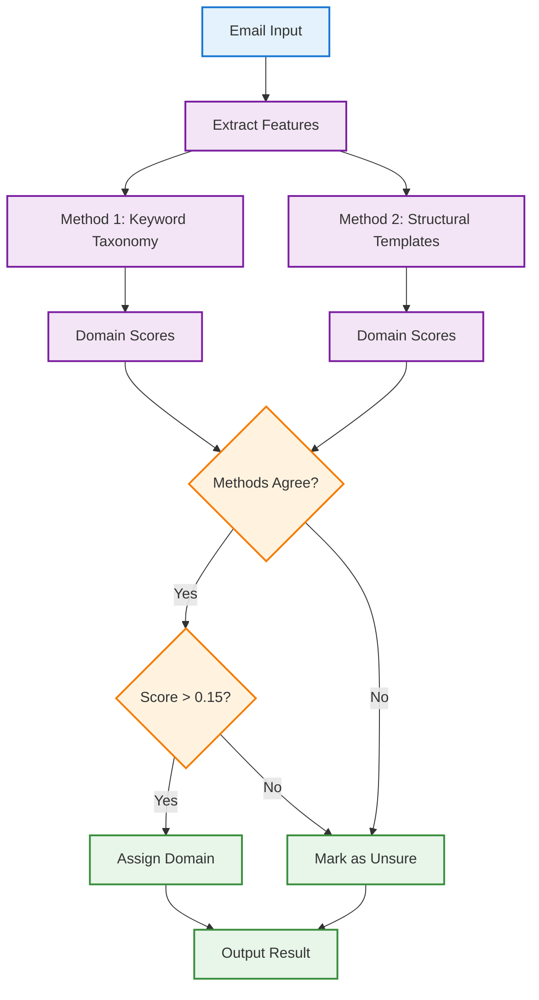
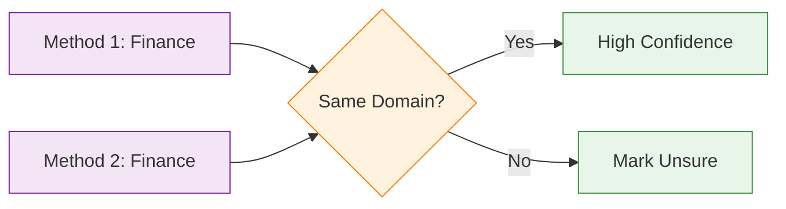

# Classification Flow

This document describes the email classification process in detail.

## Classification Pipeline

## Method 1: Keyword Taxonomy (60% Weight)

Analyzes email content against domain-specific keyword taxonomies:

| Factor | Description | Weight |
|--------|-------------|--------|
| Primary Keywords | Core domain terms | High |
| Secondary Keywords | Supporting terms | Medium |
| Sender Patterns | Email domain patterns | Medium |
| Subject Patterns | Subject line patterns | Low |

## Method 2: Structural Templates (40% Weight)

Analyzes email structure and format:

| Factor | Description |
|--------|-------------|
| Body Length | Typical character range for domain |
| Greeting | Presence of formal greeting |
| Signature | Presence of signature block |
| Disclaimer | Presence of legal disclaimer |
| Formality | Formal, semi-formal, or casual |
| Paragraph Count | Typical structure for domain |

## Agreement Requirement

Classification requires **both methods to agree** on the top domain:

## Confidence Threshold

- **Minimum Score**: 0.15 combined confidence
- **Combined Score**: `(Method1 * 0.6) + (Method2 * 0.4)`

## Related Documentation

- [Architecture Overview](overview.md)
- [Data Flow](data-flow.md)
- [Domain Profiles](../design/domain-profiles.md)
