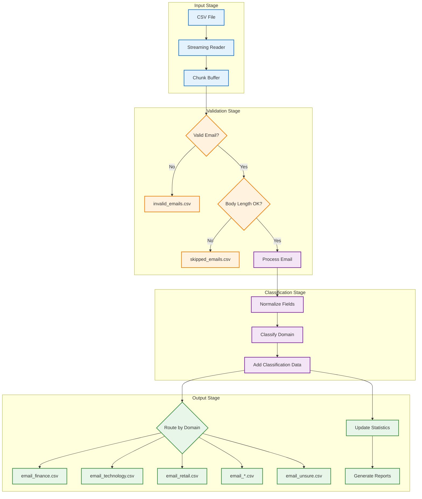
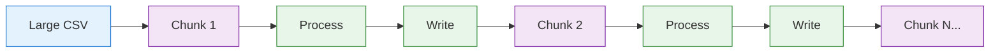

# Data Flow

This document describes how data flows through the Email Domain Classifier.

## Processing Pipeline

## Data Transformations

### Input Normalization

| Input Column | Output Column | Transformation |
|--------------|---------------|----------------|
| `timestamp` | `date` | Renamed |
| `has_url` | `urls` | Renamed |
| `sender` | `sender` | Validated format |
| `receiver` | `receiver` | Validated format |
| `subject` | `subject` | Trimmed whitespace |
| `body` | `body` | Trimmed whitespace |

### Output Enrichment

Each processed email receives additional columns:

| Column | Description |
|--------|-------------|
| `label` | Classified domain |
| `classified_domain` | Same as label |
| `method1_domain` | Keyword method result |
| `method2_domain` | Structural method result |

### Optional Detail Columns

When `--include-details` is enabled:

| Column | Description |
|--------|-------------|
| `method1_confidence` | Keyword method confidence |
| `method2_confidence` | Structural method confidence |
| `agreement` | Whether methods agreed |

## Memory Efficiency

The streaming processor handles large files efficiently:

- **Default Chunk Size**: 1000 emails
- **Memory Usage**: ~2MB per 1000 emails
- **Configurable**: `--chunk-size` CLI option

## Related Documentation

- [Architecture Overview](overview.md)
- [Classification Flow](classification-flow.md)
- [Installation Guide](../integration/installation.md)
