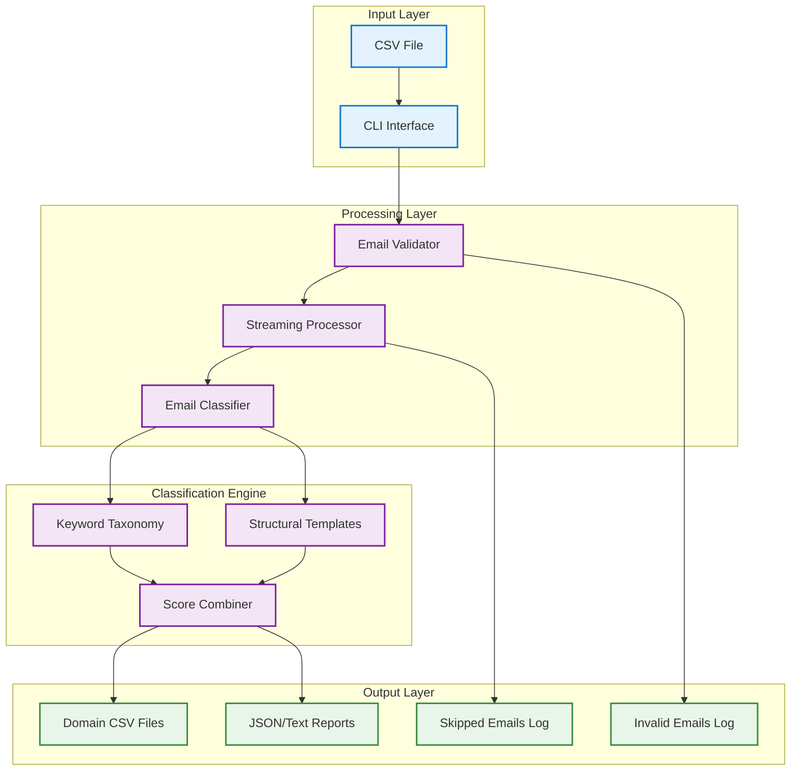

# Architecture Overview

The Email Domain Classifier is a Python-based system for classifying emails into business domains using dual-method validation.

## System Architecture

## Core Components

| Component | Module | Responsibility |
|-----------|--------|----------------|
| **CLI** | `cli.py` | Command-line interface, argument parsing |
| **Validator** | `validator.py` | Email format validation, data quality checks |
| **Processor** | `processor.py` | Streaming CSV processing, memory efficiency |
| **Classifier** | `classifier.py` | Dual-method classification engine |
| **Domains** | `domains.py` | Domain profiles and keyword taxonomies |
| **Reporter** | `reporter.py` | Report generation (JSON, text) |
| **UI** | `ui.py` | Terminal UI with Rich library |
| **Analyzer** | `analyzer.py` | Dataset analysis (info command) |

## Design Principles

1. **Streaming Processing** - Memory-efficient handling of large datasets
2. **Dual-Method Validation** - High confidence through method agreement
3. **Extensible Domains** - Easy addition of new business domains
4. **Rich Terminal UI** - Beautiful progress bars and formatted output

## Related Documentation

- [Classification Flow](classification-flow.md) - Detailed classification process
- [Data Flow](data-flow.md) - Data processing pipeline
- [Design: Dual-Method Validation](../design/dual-method-validation.md) - Classification design decisions
