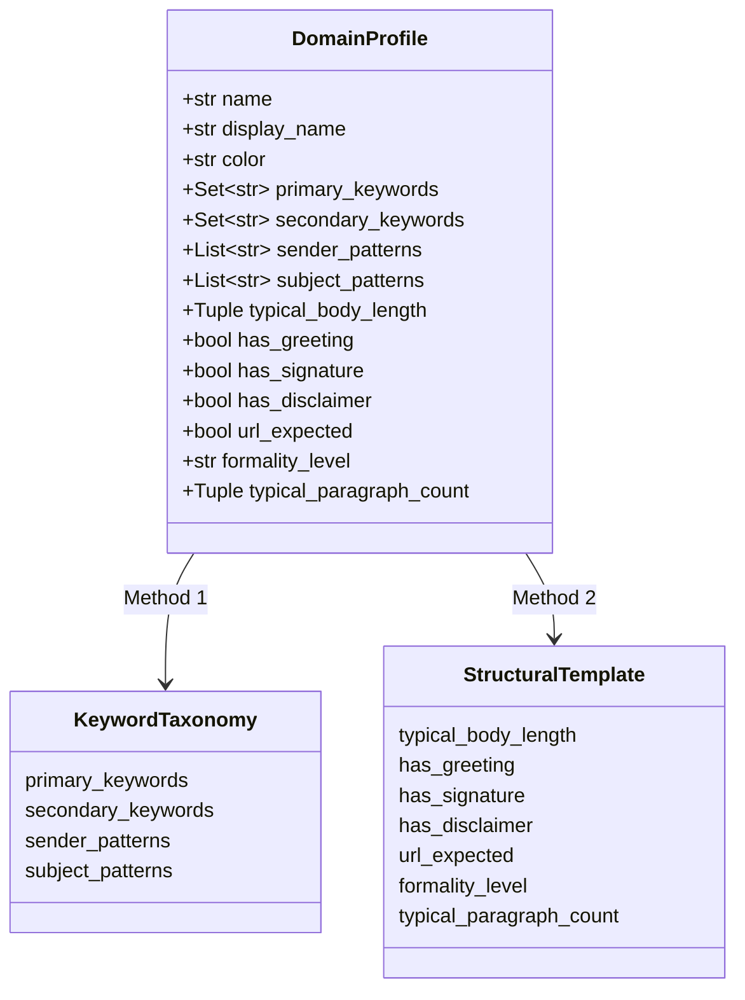
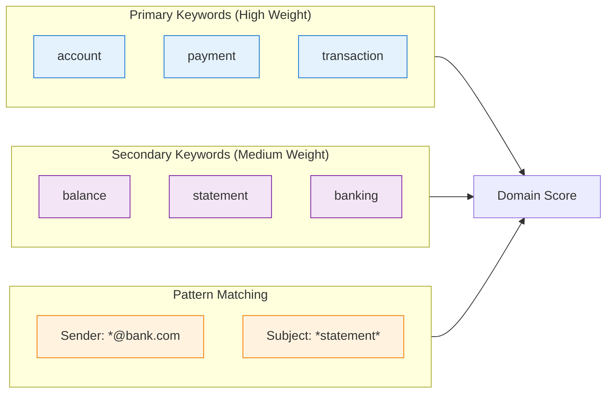

# Design: Domain Profiles

This document describes the domain profile system used for email classification.

## Domain Profile Structure

Each domain is defined by a `DomainProfile` dataclass:



## Supported Domains

| Domain | Display Name | Formality | URL Expected |
|--------|--------------|-----------|--------------|
| `finance` | Finance | Formal | Yes |
| `technology` | Technology | Semi-formal | Yes |
| `retail` | Retail | Semi-formal | Yes |
| `logistics` | Logistics | Formal | Yes |
| `healthcare` | Healthcare | Formal | No |
| `government` | Government | Formal | No |
| `hr` | HR | Formal | No |
| `telecommunications` | Telecom | Semi-formal | Yes |
| `social_media` | Social Media | Casual | Yes |
| `education` | Education | Semi-formal | Yes |

## Profile Components

### Keyword Taxonomy (Method 1)



### Structural Template (Method 2)

| Attribute | Finance Example | Social Media Example |
|-----------|----------------|---------------------|
| Body Length | 500-2000 chars | 100-500 chars |
| Has Greeting | Yes | No |
| Has Signature | Yes | No |
| Has Disclaimer | Yes | No |
| Formality | Formal | Casual |
| Paragraphs | 3-6 | 1-2 |

## Adding New Domains

To add a new domain, define a profile in `domains.py`:

```python
DOMAINS["new_domain"] = DomainProfile(
    name="new_domain",
    display_name="New Domain",
    color="bright_cyan",
    # Keyword Taxonomy
    primary_keywords={"keyword1", "keyword2"},
    secondary_keywords={"support1", "support2"},
    sender_patterns=[r".*@newdomain\.com"],
    subject_patterns=[r".*new.*"],
    # Structural Template
    typical_body_length=(200, 1000),
    has_greeting=True,
    has_signature=True,
    has_disclaimer=False,
    url_expected=True,
    formality_level="semi-formal",
    typical_paragraph_count=(2, 4),
)
```

## Related Documentation

- [Dual-Method Validation](dual-method-validation.md)
- [Classification Flow](../architecture/classification-flow.md)
