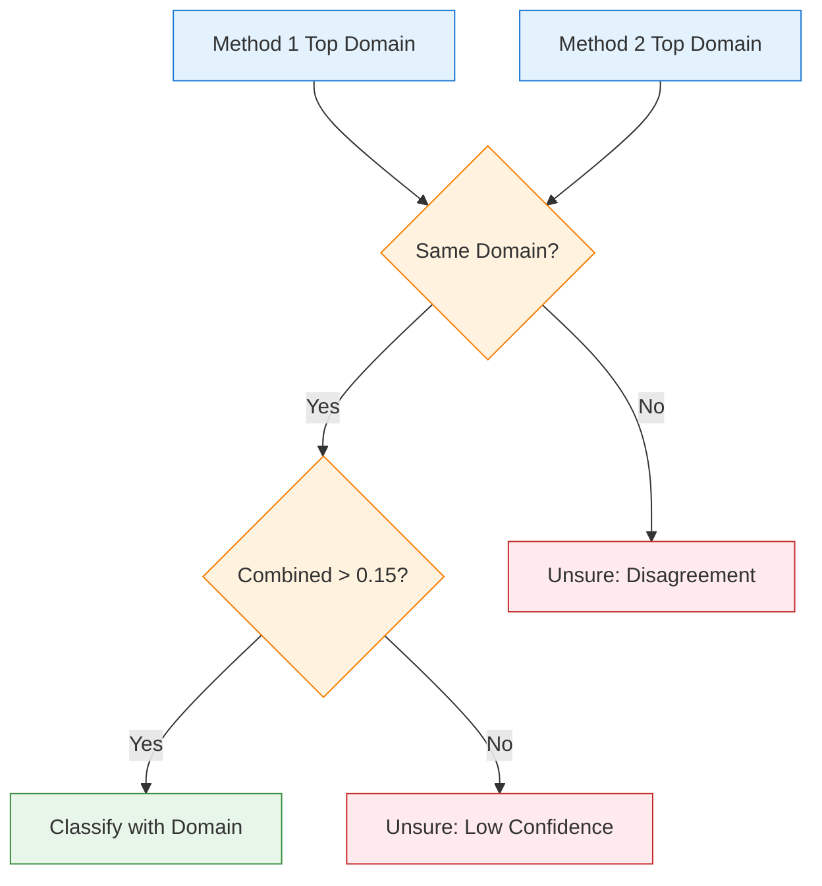

# Design: Dual-Method Validation

This document explains the design rationale for the dual-method classification approach.

## Problem Statement

Single-method email classification suffers from:

- **False positives**: Keywords alone can be misleading
- **Context blindness**: Structure alone misses semantic meaning
- **Low confidence**: Hard to distinguish between similar domains

## Solution: Dual-Method Agreement

Combine two complementary classification methods that must agree for confident classification.

```mermaid
flowchart TD
    subgraph Problem["Single Method Problems"]
        K1[Keyword: "bank" in body]
        K1 --> FP1[False Positive: River Bank Blog]

        S1[Structure: Formal email]
        S1 --> FP2[False Positive: Legal, HR, Gov all formal]
    end

    subgraph Solution["Dual Method Solution"]
        Email[Email Input]
        Email --> Keywords[Keyword Analysis]
        Email --> Structure[Structure Analysis]

        Keywords --> Domain1[Finance: 0.8]
        Structure --> Domain2[Finance: 0.7]

        Domain1 --> Agree{Both agree?}
        Domain2 --> Agree

        Agree -->|Yes| High[High Confidence]
    end

    classDef problem fill:#ffebee,stroke:#c62828
    classDef solution fill:#e8f5e9,stroke:#388e3c

    class K1,S1,FP1,FP2 problem
    class Email,Keywords,Structure,Domain1,Domain2,Agree,High solution
```

## Method Comparison

| Aspect | Method 1: Keywords | Method 2: Structure |
|--------|-------------------|---------------------|
| **Input** | Text content | Format/layout |
| **Strengths** | Semantic meaning | Genre detection |
| **Weaknesses** | Context-sensitive | Content-blind |
| **Weight** | 60% | 40% |

## Agreement Logic



## Trade-offs

### Advantages

1. **Higher Precision**: Agreement reduces false positives
2. **Confidence Indication**: Disagreement signals uncertainty
3. **Complementary Analysis**: Catches what single methods miss

### Disadvantages

1. **Lower Recall**: Some valid classifications marked unsure
2. **Complexity**: Two systems to maintain
3. **Performance**: Slightly slower than single method

## Tuning Parameters

| Parameter | Default | Effect |
|-----------|---------|--------|
| Method 1 Weight | 0.6 | Higher = more keyword influence |
| Method 2 Weight | 0.4 | Higher = more structure influence |
| Confidence Threshold | 0.15 | Higher = fewer but more confident results |

## Related Documentation

- [Classification Flow](../architecture/classification-flow.md)
- [Domain Profiles](domain-profiles.md)
