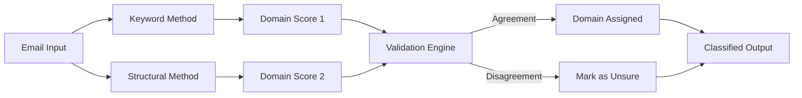
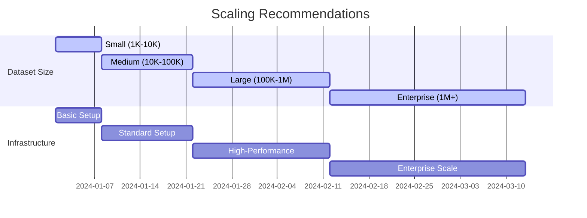

# Email Domain Classifier Documentation

Welcome to the comprehensive documentation for Email Domain Classifier! This powerful Python library classifies emails by domain using dual-method validation combining keyword taxonomy matching and structural template analysis.

## 🚀 Quick Start

```bash
# Install and run in 5 minutes
git clone https://github.com/montimage/email-domain-classifier.git
cd email-domain-classifier
python -m venv .venv && source .venv/bin/activate
pip install -e .
email-cli sample_emails.csv -o output/
```

## 📚 Documentation Structure

```mermaid
flowchart TD
    Docs[Documentation] --> User[User Guide]
    Docs --> API[API Reference]
    Docs --> Arch[Architecture]
    Docs --> Design[Design]
    Docs --> Int[Integration]
    Docs --> Troubleshoot[Troubleshooting]
    Docs --> Deploy[Deployment]
    Docs --> Dev[Development]

    User --> Quick[Quick Start]
    User --> Usage[Usage Examples]
    User --> CLI[CLI Reference]
    User --> TroubleshootUser[Troubleshooting]

    API --> Classes[Class Documentation]
    API --> Methods[Method Reference]
    API --> Examples[Code Examples]

    Arch --> Overview[Architecture Overview]
    Arch --> Flow[Classification Flow]
    Arch --> Data[Data Flow]

    Design --> Classification[Classification Design]
    Design --> Streaming[Streaming Design]
    Design --> Patterns[Design Patterns]

    Int --> Install[Installation]
    Int --> Requirements[System Requirements]
    Int --> ThirdParty[Third Party Integration]

    Troubleshoot --> Common[Common Issues]
    Troubleshoot --> Debug[Debugging]
    Troubleshoot --> Performance[Performance]

    Deploy --> Production[Production Setup]
    Deploy --> Container[Container Deployment]
    Deploy --> Cloud[Cloud Deployment]

    Dev --> Setup[Development Setup]
    Dev --> Contributing[Contributing]
    Dev --> Testing[Testing]

    %% Styling
    classDef main fill:#e3f2fd,stroke:#1976d2,stroke-width:3px
    classDef section fill:#f3e5f5,stroke:#7b1fa2,stroke-width:2px
    classDef page fill:#e8f5e8,stroke:#388e3c,stroke-width:2px

    class Docs main
    class User,API,Arch,Design,Int,Troubleshoot,Deploy,Dev section
    class Quick,Usage,CLI,TroubleshootUser,Classes,Methods,Examples,Overview,Flow,Data,Classification,Streaming,Patterns,Install,Requirements,ThirdParty,Common,Debug,Performance,Production,Container,Cloud,Setup,Contributing,Testing page
```



## 📖 Key Documentation Sections

### 🎯 User Documentation

**[User Guide](user-guide/)** - Complete usage guide for end users
- [Quick Start](user-guide/quick-start.md) - Get started in 5 minutes
- [Usage Examples](user-guide/usage-examples.md) - Detailed examples and use cases
- [CLI Reference](user-guide/cli-reference.md) - Complete command-line reference
- [Troubleshooting](user-guide/troubleshooting.md) - Common user issues and solutions

### 📡 API Documentation

**[API Reference](api/)** - Complete Python API documentation
- [EmailClassifier](api/email-classifier.md) - Main classification interface
- [StreamingProcessor](api/streaming-processor.md) - Batch processing utilities
- [Domains](api/domains.md) - Domain system and configuration
- [Reporter](api/reporter.md) - Report generation classes
- [UI Components](api/ui.md) - Terminal interface components

### 🏛️ Architecture Documentation

**[Architecture](architecture/)** - System design and technical architecture
- [Overview](architecture/overview.md) - High-level system architecture
- [Classification Flow](architecture/classification-flow.md) - Email classification process
- [Data Flow](architecture/data-flow.md) - Data processing pipeline
- [Design Patterns](architecture/design-patterns.md) - Software patterns used

### 🎨 Design Documentation

**[Design](design/)** - Implementation details and design decisions
- [Classification Design](design/domain-classification.md) - Classification algorithm design
- [Dual-Method Validation](design/dual-method-validation.md) - Validation methodology
- [Streaming Processing](design/streaming-processing.md) - Large dataset processing
- [UI Design](design/ui-design.md) - Terminal interface design

### 🔧 Integration & Installation

**[Integration](integration/)** - System integration and deployment
- [Installation Guide](installation.md) - Complete installation instructions
- [System Requirements](integration/system-requirements.md) - Hardware and software requirements
- [Environment Setup](integration/environment-setup.md) - Configuration and environment
- [Third Party Integration](integration/third-party-integration.md) - Integration with other systems

### 🔍 Troubleshooting

**[Troubleshooting](troubleshooting/)** - Problem solving and debugging
- [Common Issues](troubleshooting/common-issues.md) - Frequently encountered problems
- [Debugging Guide](troubleshooting/debugging.md) - Debugging procedures and tools
- [Performance Tuning](troubleshooting/performance.md) - Performance optimization
- [Error Codes](troubleshooting/error-codes.md) - Error reference and solutions

### 🚀 Playbooks

**Deployment & Development Guides**
- [Deployment Playbook](deployment-playbook.md) - Production deployment procedures
- [Development Playbook](development-playbook.md) - Development environment and contribution guide

## ✨ Key Features

### Dual-Method Classification



The classifier uses **two independent methods** for maximum accuracy:
1. **Keyword Taxonomy Matching** - Analyzes domain-specific keywords, patterns, and terminology
2. **Structural Template Matching** - Evaluates email structure, formality, and content patterns

**Both methods must agree** before classifying an email, ensuring high-confidence results.

### Supported Domains

| Domain | Icon | Description | Common Examples |
|--------|-------|-------------|-----------------|
| **Finance** | 💰 | Banking, payments, financial services | Bank statements, payment confirmations |
| **Technology** | 💻 | Software, hardware, IT services | Software updates, tech support |
| **Retail** | 🛒 | E-commerce, shopping, consumer goods | Shopping receipts, order confirmations |
| **Logistics** | 📦 | Shipping, supply chain, transportation | Delivery notifications, tracking |
| **Healthcare** | 🏥 | Medical services, health insurance | Appointment reminders, medical bills |
| **Government** | 🏛️ | Public sector, regulatory agencies | Tax notices, official communications |
| **HR** | 👥 | Human resources, recruitment, employee services | Job applications, HR notifications |
| **Telecommunications** | 📞 | Phone, internet, communication services | Bill notifications, service updates |
| **Social Media** | 📱 | Social platforms, networking services | Platform notifications, activity updates |
| **Education** | 🎓 | Schools, universities, learning platforms | Course materials, academic notices |

### Memory-Efficient Processing

- **Streaming Architecture** - Process datasets of any size without memory limitations
- **Configurable Chunk Sizes** - Optimize for your system capabilities
- **Progress Tracking** - Real-time progress with beautiful terminal output
- **Scalable Design** - From 100 emails to 10M+ emails efficiently

## 🎯 Getting Started

### For Users

1. **[Install the classifier](installation.md)** - Quick setup in 5 minutes
2. **[Try the quick start](user-guide/quick-start.md)** - Classify your first emails
3. **[Explore usage examples](user-guide/usage-examples.md)** - Learn advanced features
4. **[Check CLI reference](user-guide/cli-reference.md)** - All options and commands

### For Developers

1. **[Set up development](development-playbook.md)** - Complete development environment
2. **[Understand architecture](architecture/overview.md)** - System design and patterns
3. **[Review API documentation](api/)** - Integration and extension points
4. **[Contribute to project](development-playbook.md#contributing)** - Development workflow

### For DevOps Engineers

1. **[Deploy to production](deployment-playbook.md)** - Complete deployment guide
2. **[Configure environment](integration/environment-setup.md)** - System configuration
3. **[Monitor performance](troubleshooting/performance.md)** - Optimization and tuning
4. **[Troubleshoot issues](troubleshooting/)** - Problem resolution

## 🔍 Navigation Help

### Finding Information

- **Beginner?** Start with [Quick Start Guide](user-guide/quick-start.md)
- **Need help?** Check [Troubleshooting](troubleshooting/) section
- **Integrating?** Review [API Documentation](api/) and [Integration Guide](integration/)
- **Deploying?** Follow [Deployment Playbook](deployment-playbook.md)
- **Developing?** Read [Development Playbook](development-playbook.md)

### Search Tips

```bash
# Search documentation locally
grep -r "keyword" docs/

# Find specific function documentation
find docs/ -name "*.md" -exec grep -l "EmailClassifier" {} \;

# Search by category
ls docs/user-guide/      # User-focused documentation
ls docs/api/              # API documentation
ls docs/architecture/      # Technical documentation
```

## 📊 Performance & Scalability

### Performance Benchmarks

| Dataset Size | Processing Time | Memory Usage | Recommended Setup |
|-------------|----------------|---------------|------------------|
| 1K emails | < 5 seconds | 50MB | Basic setup |
| 10K emails | < 1 minute | 200MB | Standard setup |
| 100K emails | < 10 minutes | 1GB | 4GB RAM, SSD |
| 1M emails | < 1 hour | 5GB | 8GB RAM, high-performance SSD |
| 10M emails | < 10 hours | 20GB | 16GB RAM, enterprise SSD |

### Scaling Recommendations



## 🔗 External Links

- **GitHub Repository**: https://github.com/montimage/email-domain-classifier
- **PyPI Package**: https://pypi.org/project/email-domain-classifier/
- **Issue Tracker**: https://github.com/montimage/email-domain-classifier/issues
- **Discussions**: https://github.com/montimage/email-domain-classifier/discussions
- **Security Issues**: security@montimage.com

## 🆘 Getting Help

### Quick Help Options

```bash
# Get CLI help
email-cli --help

# List supported domains
email-cli --list-domains

# Check version
email-cli --version
```

### Community Support

- **Documentation Issues**: [Create documentation issue](https://github.com/montimage/email-domain-classifier/issues/new?assignees=&labels=documentation&template=documentation.md)
- **Feature Requests**: [Suggest new features](https://github.com/montimage/email-domain-classifier/issues/new?assignees=&labels=enhancement&template=feature_request.md)
- **Bug Reports**: [Report bugs](https://github.com/montimage/email-domain-classifier/issues/new?assignees=&labels=bug&template=bug_report.md)
- **Questions**: [Ask community](https://github.com/montimage/email-domain-classifier/discussions/categories/q-a)

### Professional Support

- **Email**: research@montimage.com
- **Enterprise Support**: Available for commercial deployments
- **Consulting**: Custom integration and optimization services

---

**Start here**: [Quick Start Guide](user-guide/quick-start.md) • [Installation](installation.md) • [API Docs](api/) • [Development](development-playbook.md)