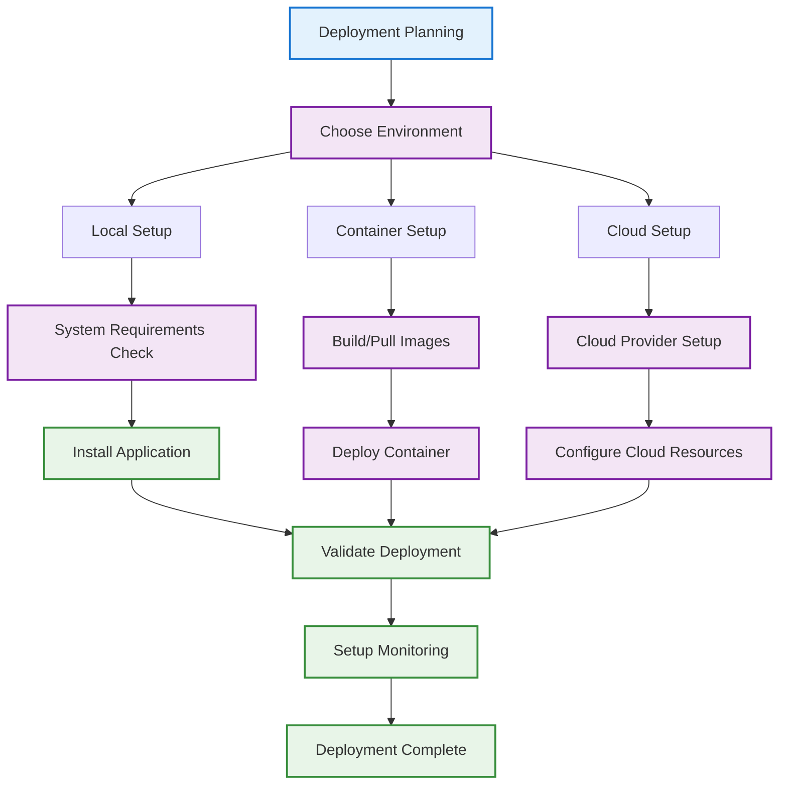
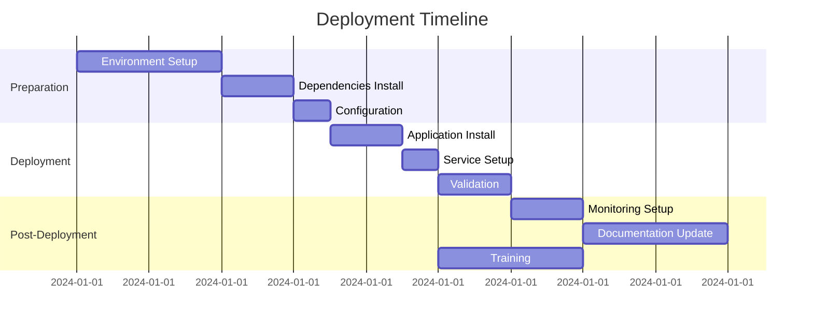

# Deployment Playbook

Complete guide for deploying Email Domain Classifier in production environments. This playbook covers system requirements, installation, configuration, and operational procedures.

## 🎯 Deployment Overview

The Email Domain Classifier can be deployed in various environments:

- **Local Deployment** - Single machine setup
- **Container Deployment** - Docker/Podman containers
- **Cloud Deployment** - AWS, GCP, Azure
- **Cluster Deployment** - Kubernetes, Docker Swarm



## 📋 System Requirements

### Minimum Requirements

| Resource | Minimum | Recommended | With LLM |
|-----------|----------|-------------|----------|
| **CPU** | 2 cores | 4+ cores | 4+ cores |
| **RAM** | 4GB | 8GB+ | 16GB+ (Ollama) |
| **Storage** | 10GB | 50GB+ SSD | 100GB+ SSD (for local models) |
| **OS** | Linux/macOS/Windows | Linux (Ubuntu 20.04+) | Linux (Ubuntu 20.04+) |
| **Python** | 3.10 | 3.11+ | 3.11+ |
| **Network** | Optional | Optional | Required (cloud providers) |

### Performance Scaling

| Dataset Size | Memory Required | Processing Time | With LLM (Cloud) | With LLM (Ollama) |
|-------------|-----------------|------------------|------------------|-------------------|
| 10K emails | 100MB | 1-2 min | 5-10 min | 15-30 min |
| 100K emails | 500MB | 10-15 min | 1-2 hours | 3-5 hours |
| 1M emails | 2GB | 1-2 hours | 10-20 hours | 30-50 hours |
| 10M emails | 10GB | 10+ hours | Not recommended | Not recommended |

### LLM Provider Comparison

| Provider | Latency | Cost | Privacy | Offline |
|----------|---------|------|---------|---------|
| **Ollama (Local)** | 500-2000ms | Free | Full | Yes |
| **Google Gemini** | 100-500ms | Pay-per-use | Cloud | No |
| **Mistral** | 150-600ms | Pay-per-use | EU Cloud | No |
| **Groq** | 50-200ms | Pay-per-use | Cloud | No |
| **OpenRouter** | Varies | Pay-per-use | Cloud | No |

## 🚀 Local Deployment

### Step 1: Environment Setup

```bash
# Update system packages
sudo apt update && sudo apt upgrade -y  # Ubuntu/Debian
# or
sudo yum update && sudo yum upgrade -y  # CentOS/RHEL

# Install Python 3.11
sudo apt install python3.11 python3.11-venv python3.11-dev

# Install Git
sudo apt install git
```

### Step 2: Application Installation

```bash
# Clone repository
git clone https://github.com/montimage/email-domain-classifier.git
cd email-domain-classifier

# Create virtual environment
python3.11 -m venv .venv
source .venv/bin/activate

# Install application
pip install -e .

# Verify installation
email-cli --version
```

### Step 3: Configuration

```bash
# Create configuration directory
sudo mkdir -p /etc/email-classifier
sudo mkdir -p /var/log/email-classifier
sudo mkdir -p /var/lib/email-classifier

# Set permissions
sudo chown -R $USER:$USER /etc/email-classifier
sudo chown -R $USER:$USER /var/log/email-classifier
sudo chown -R $USER:$USER /var/lib/email-classifier

# Create configuration file
cat > /etc/email-classifier/config.yaml << 'EOF'
# Email Classifier Configuration
default_output_dir: "/var/lib/email-classifier/output"
log_level: "INFO"
log_file: "/var/log/email-classifier/classifier.log"
default_chunk_size: 1000
max_memory_usage: "4GB"
enable_detailed_logging: false
EOF
```

### Step 4: System Service Setup

```bash
# Create systemd service
sudo tee /etc/systemd/system/email-classifier.service > /dev/null << 'EOF'
[Unit]
Description=Email Domain Classifier Service
After=network.target

[Service]
Type=oneshot
User=email-classifier
Group=email-classifier
WorkingDirectory=/opt/email-classifier
Environment=PATH=/opt/email-classifier/.venv/bin
ExecStart=/opt/email-classifier/.venv/bin/email-classifier
StandardOutput=journal
StandardError=journal

[Install]
WantedBy=multi-user.target
EOF

# Create user
sudo useradd -r -s /bin/false email-classifier

# Enable and start service
sudo systemctl daemon-reload
sudo systemctl enable email-classifier
```

## 🐳 Container Deployment

### Dockerfile

```dockerfile
FROM python:3.11-slim

# Set working directory
WORKDIR /app

# Install system dependencies
RUN apt-get update && apt-get install -y \
    git \
    && rm -rf /var/lib/apt/lists/*

# Copy application
COPY . .

# Install application
RUN pip install -e .

# Create directories
RUN mkdir -p /app/output /app/logs

# Set permissions
RUN chmod +x /app/output /app/logs

# Expose volume
VOLUME ["/app/input", "/app/output", "/app/logs"]

# Default command
CMD ["email-cli", "--help"]
```

### Docker Compose

```yaml
version: '3.8'

services:
  email-classifier:
    build: .
    container_name: email-classifier
    environment:
      - PYTHONPATH=/app
      - LOG_LEVEL=INFO
    volumes:
      - ./data/input:/app/input:ro
      - ./data/output:/app/output
      - ./logs:/app/logs
    command: >
      email-cli
      /app/input/emails.csv
      -o /app/output
      --verbose
      --log-file /app/logs/classification.log
    restart: unless-stopped

  monitoring:
    image: prom/prometheus:latest
    container_name: email-classifier-monitoring
    ports:
      - "9090:9090"
    volumes:
      - ./monitoring/prometheus.yml:/etc/prometheus/prometheus.yml
    restart: unless-stopped
```

### Docker Compose with LLM Support

```yaml
version: '3.8'

services:
  email-classifier:
    build: .
    container_name: email-classifier
    environment:
      - PYTHONPATH=/app
      - LOG_LEVEL=INFO
      # LLM Configuration
      - LLM_PROVIDER=${LLM_PROVIDER:-ollama}
      - LLM_MODEL=${LLM_MODEL:-llama3.2}
      - LLM_TEMPERATURE=0.0
      - LLM_TIMEOUT=30
      - LLM_RETRY_COUNT=3
      - KEYWORD_WEIGHT=0.35
      - STRUCTURAL_WEIGHT=0.25
      - LLM_WEIGHT=0.40
      # Ollama connection (for local LLM)
      - OLLAMA_BASE_URL=http://ollama:11434
      # Cloud provider keys (use secrets in production)
      - GOOGLE_API_KEY=${GOOGLE_API_KEY:-}
      - MISTRAL_API_KEY=${MISTRAL_API_KEY:-}
      - GROQ_API_KEY=${GROQ_API_KEY:-}
    volumes:
      - ./data/input:/app/input:ro
      - ./data/output:/app/output
      - ./logs:/app/logs
      - ./.env:/app/.env:ro  # Mount .env file
    command: >
      email-cli
      /app/input/emails.csv
      -o /app/output
      --use-llm
      --verbose
      --log-file /app/logs/classification.log
    depends_on:
      - ollama
    restart: unless-stopped

  # Ollama sidecar for local LLM inference
  ollama:
    image: ollama/ollama:latest
    container_name: ollama
    volumes:
      - ollama_data:/root/.ollama
    ports:
      - "11434:11434"
    restart: unless-stopped
    # Pull model on first run
    entrypoint: ["/bin/sh", "-c"]
    command:
      - |
        /bin/ollama serve &
        sleep 5
        /bin/ollama pull llama3.2
        wait

  monitoring:
    image: prom/prometheus:latest
    container_name: email-classifier-monitoring
    ports:
      - "9090:9090"
    volumes:
      - ./monitoring/prometheus.yml:/etc/prometheus/prometheus.yml
    restart: unless-stopped

volumes:
  ollama_data:
```

### Docker Compose with Cloud LLM Provider

```yaml
version: '3.8'

services:
  email-classifier:
    build: .
    container_name: email-classifier
    env_file:
      - .env  # Contains LLM_PROVIDER, API keys, etc.
    environment:
      - PYTHONPATH=/app
      - LOG_LEVEL=INFO
    volumes:
      - ./data/input:/app/input:ro
      - ./data/output:/app/output
      - ./logs:/app/logs
    command: >
      email-cli
      /app/input/emails.csv
      -o /app/output
      --use-llm
      --verbose
    restart: unless-stopped
```

### Container Commands

```bash
# Build image
docker build -t email-classifier:latest .

# Run container
docker run --rm \
  -v $(pwd)/data:/app/data \
  -v $(pwd)/output:/app/output \
  email-classifier:latest \
  email-cli /app/data/emails.csv -o /app/output

# Use Docker Compose
docker-compose up -d

# View logs
docker-compose logs -f email-classifier

# Stop services
docker-compose down
```

## ☁️ Cloud Deployment

### AWS Deployment

```bash
# 1. Launch EC2 Instance
aws ec2 run-instances \
  --image-id ami-0c02fb55956c7d3166 \
  --instance-type t3.medium \
  --key-name my-key-pair \
  --security-group-ids sg-903004f8 \
  --subnet-id subnet-6e7f829e \
  --user-data file://cloud-init.txt

# 2. Cloud Init Script (cloud-init.txt)
#!/bin/bash
apt-get update -y
apt-get install -y python3.11 python3.11-venv git
cd /opt
git clone https://github.com/montimage/email-domain-classifier.git
cd email-domain-classifier
python3.11 -m venv .venv
source .venv/bin/activate
pip install -e .

# 3. S3 Setup
aws s3 mb s3://email-classifier-data
aws s3 cp sample-data.csv s3://email-classifier-data/input/

# 4. Run with S3
email-cli s3://email-classifier-data/input/emails.csv -o s3://email-classifier-data/output/
```

### GCP Deployment

```bash
# Create Compute Engine instance
gcloud compute instances create email-classifier \
  --machine-type=n2-standard-2 \
  --image-family=ubuntu-2204-lts \
  --image-project=ubuntu-os-cloud \
  --metadata-from-file startup-script=startup.sh

# startup.sh
#!/bin/bash
apt-get update
apt-get install -y python3.11 python3.11-venv git
cd /opt
git clone https://github.com/montimage/email-domain-classifier.git
cd email-domain-classifier
python3.11 -m venv .venv
source .venv/bin/activate
pip install -e .
```

### Azure Deployment

```bash
# Create Resource Group
az group create --name email-cli --location eastus

# Create VM
az vm create \
  --resource-group email-classifier \
  --name email-classifier-vm \
  --image Ubuntu2204 \
  --size Standard_B2s \
  --admin-username azureuser \
  --generate-ssh-keys

# Configure VM
ssh azureuser@<vm-ip>
# Follow local deployment steps
```

## 📊 Monitoring and Logging

### Application Monitoring

```yaml
# prometheus.yml
global:
  scrape_interval: 15s

scrape_configs:
  - job_name: 'email-classifier'
    static_configs:
      - targets: ['localhost:8000']
    metrics_path: '/metrics'
    scrape_interval: 5s
```

### Log Management

```bash
# Configure log rotation
sudo tee /etc/logrotate.d/email-classifier > /dev/null << 'EOF'
/var/log/email-classifier/*.log {
    daily
    missingok
    rotate 30
    compress
    delaycompress
    notifempty
    create 644 email-classifier email-classifier
}
EOF

# Set up log monitoring
tail -f /var/log/email-classifier/classification.log | \
  grep -E "(ERROR|WARN|CRITICAL)"
```

### Performance Monitoring

```python
# monitoring.py
import psutil
import time
from email_classifier import EmailClassifier

def monitor_performance():
    classifier = EmailClassifier()

    while True:
        # Memory usage
        memory = psutil.virtual_memory()
        print(f"Memory: {memory.percent}% used")

        # CPU usage
        cpu = psutil.cpu_percent(interval=1)
        print(f"CPU: {cpu}% used")

        # Processing speed
        start_time = time.time()
        # Simulate processing
        print(f"Processing rate: {1000/(time.time()-start_time):.2f} emails/sec")

        time.sleep(60)

if __name__ == "__main__":
    monitor_performance()
```

### LLM-Specific Monitoring

When LLM classification is enabled, monitor these additional metrics:

```yaml
# prometheus-llm-alerts.yml
groups:
  - name: llm-classification
    rules:
      # LLM latency monitoring
      - alert: HighLLMLatency
        expr: llm_request_duration_seconds > 5
        for: 5m
        labels:
          severity: warning
        annotations:
          summary: "LLM requests taking longer than 5 seconds"

      # LLM error rate
      - alert: HighLLMErrorRate
        expr: rate(llm_errors_total[5m]) > 0.1
        for: 5m
        labels:
          severity: critical
        annotations:
          summary: "LLM error rate above 10%"

      # Ollama service health
      - alert: OllamaServiceDown
        expr: up{job="ollama"} == 0
        for: 1m
        labels:
          severity: critical
        annotations:
          summary: "Ollama service is down"

      # Token usage (if tracked)
      - alert: HighTokenUsage
        expr: sum(rate(llm_tokens_used_total[1h])) > 100000
        for: 1h
        labels:
          severity: warning
        annotations:
          summary: "High token usage detected"
```

### LLM Logging Configuration

```python
# llm_logging.py - Configure detailed LLM logging
import logging

# Enable LLM debug logging
logging.getLogger('email_classifier.llm').setLevel(logging.DEBUG)

# Log LLM requests and responses
logging.getLogger('email_classifier.llm.agent').setLevel(logging.DEBUG)

# Log provider-specific details
logging.getLogger('langchain').setLevel(logging.INFO)
```

```bash
# Environment-based logging configuration
export LOG_LEVEL=INFO
export LLM_LOG_LEVEL=DEBUG  # Verbose LLM logging

# Log to file with rotation
email-cli input.csv -o output/ --use-llm \
  --log-file /var/log/email-classifier/llm.log \
  --log-level DEBUG
```

## 🔄 Deployment Process

### Pre-Deployment Checklist

- [ ] **System Requirements** - Verify minimum requirements met
- [ ] **Dependencies** - Install Python 3.11+ and required packages
- [ ] **Network Access** - Ensure internet connectivity for cloning
- [ ] **Storage Space** - Verify sufficient disk space
- [ ] **Permissions** - Set appropriate file and directory permissions
- [ ] **Security** - Configure firewall and access controls

### Deployment Steps



### Post-Deployment Validation

```bash
# Functional testing
email-cli --version
email-cli --list-domains

# Performance testing
time email-cli sample_emails.csv -o /tmp/test-output/

# Service status check
sudo systemctl status email-classifier

# Log verification
sudo journalctl -u email-classifier -f
```

## 🔧 Configuration Management

### Environment Variables

```bash
# Production configuration
export EMAIL_CLASSIFIER_ENV=production
export EMAIL_CLASSIFIER_LOG_LEVEL=INFO
export EMAIL_CLASSIFIER_OUTPUT_DIR=/var/lib/email-classifier/output
export EMAIL_CLASSIFIER_MAX_MEMORY=4GB
export EMAIL_CLASSIFIER_CHUNK_SIZE=1000
```

### Configuration File Format

```yaml
# config.yaml
email_classifier:
  environment: "production"
  log_level: "INFO"
  output_directory: "/var/lib/email-classifier/output"
  log_file: "/var/log/email-classifier/classifier.log"
  chunk_size: 1000
  max_memory_usage: "4GB"
  enable_detailed_logging: false

domains:
  custom_domains:
    - name: "internal_finance"
      keywords: ["payroll", "expense", "reimbursement"]
      pattern: ".*@company\\.com"

performance:
  enable_parallel_processing: true
  max_workers: 4
  memory_limit: "4GB"

monitoring:
  enable_metrics: true
  metrics_port: 8000
  health_check_interval: 30
```

## 🤖 LLM Configuration

### Enabling LLM Classification in Production

LLM classification (Method 3) provides semantic understanding of email content. Configure it based on your requirements:

### LLM Environment Variables

```bash
# Production LLM configuration
# Add to /etc/email-classifier/llm.env or system environment

# Provider selection
LLM_PROVIDER=google              # google, mistral, ollama, groq, openrouter

# Model configuration
LLM_MODEL=gemini-2.0-flash       # Provider-specific model name
LLM_TEMPERATURE=0.0              # Use 0.0 for deterministic classification
LLM_MAX_TOKENS=1024
LLM_TIMEOUT=30
LLM_RETRY_COUNT=3                # Increase for production reliability

# Classification method weights
KEYWORD_WEIGHT=0.35
STRUCTURAL_WEIGHT=0.25
LLM_WEIGHT=0.40

# Provider API keys (use secrets management in production)
GOOGLE_API_KEY=your-api-key      # Google Gemini
MISTRAL_API_KEY=your-api-key     # Mistral AI
GROQ_API_KEY=your-api-key        # Groq
OPENROUTER_API_KEY=your-api-key  # OpenRouter

# Ollama configuration (for local deployment)
OLLAMA_BASE_URL=http://localhost:11434
```

### Security Best Practices for API Keys

```bash
# Option 1: Use environment file with restricted permissions
sudo touch /etc/email-classifier/llm.env
sudo chmod 600 /etc/email-classifier/llm.env
sudo chown email-classifier:email-classifier /etc/email-classifier/llm.env

# Add API keys to the file
echo "GOOGLE_API_KEY=your-secret-key" | sudo tee -a /etc/email-classifier/llm.env

# Option 2: Use systemd credentials (recommended)
sudo mkdir -p /etc/email-classifier/credentials
sudo systemd-creds encrypt --name=google-api-key - /etc/email-classifier/credentials/google-api-key

# Option 3: Use cloud secrets manager
# AWS Secrets Manager, GCP Secret Manager, Azure Key Vault
```

### Ollama Local Deployment

For air-gapped or privacy-sensitive environments:

```bash
# Install Ollama
curl -fsSL https://ollama.ai/install.sh | sh

# Create Ollama service
sudo tee /etc/systemd/system/ollama.service > /dev/null << 'EOF'
[Unit]
Description=Ollama LLM Service
After=network.target

[Service]
Type=simple
User=ollama
ExecStart=/usr/local/bin/ollama serve
Restart=always
RestartSec=3

[Install]
WantedBy=multi-user.target
EOF

# Create user and start service
sudo useradd -r -s /bin/false ollama
sudo systemctl daemon-reload
sudo systemctl enable ollama
sudo systemctl start ollama

# Pull model for classification
ollama pull llama3.2

# Configure email classifier to use Ollama
echo "LLM_PROVIDER=ollama" >> /etc/email-classifier/llm.env
echo "LLM_MODEL=llama3.2" >> /etc/email-classifier/llm.env
echo "OLLAMA_BASE_URL=http://localhost:11434" >> /etc/email-classifier/llm.env
```

### Running with LLM Enabled

```bash
# Basic usage with LLM
email-cli input.csv -o output/ --use-llm

# With explicit environment file
source /etc/email-classifier/llm.env && email-cli input.csv -o output/ --use-llm

# Systemd service with LLM
# Add EnvironmentFile to service configuration
# EnvironmentFile=/etc/email-classifier/llm.env
```

## 🚨 Troubleshooting

### Common Deployment Issues

#### Permission Issues
```bash
# Fix file permissions
sudo chown -R email-classifier:email-classifier /var/lib/email-classifier
sudo chmod -R 755 /var/lib/email-classifier
```

#### Memory Issues
```bash
# Reduce chunk size
export EMAIL_CLASSIFIER_CHUNK_SIZE=500
email-cli data.csv -o output/

# Increase swap space
sudo fallocate -l 2G /swapfile
sudo chmod 600 /swapfile
sudo mkswap /swapfile
sudo swapon /swapfile
```

#### Service Failures
```bash
# Check service status
sudo systemctl status email-classifier

# View detailed logs
sudo journalctl -u email-classifier -n 100

# Restart service
sudo systemctl restart email-classifier
```

### Performance Optimization

```bash
# Optimize for large datasets
export EMAIL_CLASSIFIER_CHUNK_SIZE=2000
export EMAIL_CLASSIFIER_MAX_WORKERS=4

# Use SSD storage
mount -t ext4 /dev/sdb1 /var/lib/email-classifier

# Enable memory optimization
echo 'vm.swappiness=10' >> /etc/sysctl.conf
```

### LLM Deployment Issues

#### Provider Connection Issues

| Error | Cause | Solution |
|-------|-------|----------|
| `Connection refused` (Ollama) | Ollama not running | `sudo systemctl start ollama` |
| `401 Unauthorized` | Invalid API key | Verify API key in `.env` or environment |
| `429 Rate Limited` | Too many requests | Reduce batch size, add delays |
| `Timeout` | Slow network/model | Increase `LLM_TIMEOUT` value |

#### Ollama-Specific Issues

```bash
# Check Ollama service status
sudo systemctl status ollama
curl http://localhost:11434/api/tags

# Model not found
ollama list
ollama pull llama3.2

# Ollama out of memory
# Reduce model size or add swap
sudo fallocate -l 8G /swapfile
sudo chmod 600 /swapfile
sudo mkswap /swapfile
sudo swapon /swapfile

# Check Ollama logs
journalctl -u ollama -f
```

#### Cloud Provider Issues

```bash
# Test API connectivity
# Google
curl -H "Authorization: Bearer $GOOGLE_API_KEY" \
  https://generativelanguage.googleapis.com/v1/models

# Mistral
curl -H "Authorization: Bearer $MISTRAL_API_KEY" \
  https://api.mistral.ai/v1/models

# Verify environment variables are set
env | grep -E "(GOOGLE|MISTRAL|GROQ|OPENROUTER)_API_KEY"
```

#### Rate Limiting and Quotas

```bash
# Reduce classification rate for rate-limited APIs
export LLM_TIMEOUT=60          # Longer timeout
export LLM_RETRY_COUNT=5       # More retries
export BATCH_DELAY_MS=1000     # Add delay between batches

# For large datasets, consider:
# 1. Using Ollama (no rate limits)
# 2. Splitting into smaller batches
# 3. Using multiple API keys (if provider allows)
```

#### LLM Fallback Behavior

When LLM fails, the classifier falls back to dual-method classification:

```bash
# Check if fallback is occurring
grep "LLM classification failed" /var/log/email-classifier/classification.log

# Force dual-method only (disable LLM)
email-cli input.csv -o output/  # Without --use-llm flag
```

## 📞 Support and Maintenance

### Regular Maintenance Tasks

```bash
# Weekly: Update application
cd /opt/email-classifier
git pull
source .venv/bin/activate
pip install -e .

# Monthly: Clean old logs
find /var/log/email-classifier -name "*.log" -mtime +30 -delete

# Quarterly: Performance review
analyze-classification-logs /var/log/email-classifier/
```

### Monitoring Alerts

```yaml
# alerts.yml
groups:
  - name: email-classifier
    rules:
      - alert: HighErrorRate
        expr: error_rate > 0.05
        for: 5m
        labels:
          severity: warning
        annotations:
          summary: "High error rate detected"

      - alert: HighMemoryUsage
        expr: memory_usage > 0.8
        for: 10m
        labels:
          severity: critical
        annotations:
          summary: "Memory usage above 80%"
```

---

**Related Documentation**:
- [Development Playbook](development-playbook.md) - Development environment setup
- [User Guide](../user-guide/) - Usage instructions
- [Architecture](../architecture/) - System design
- [Troubleshooting](../troubleshooting/) - Common issues
