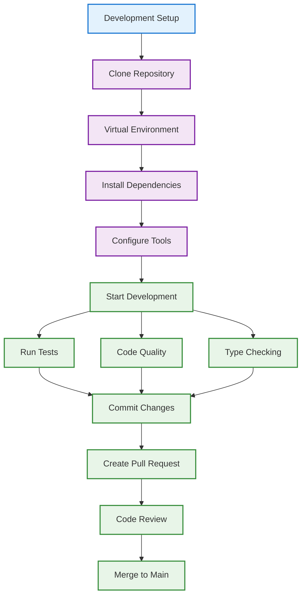

# Development Playbook

Complete guide for setting up development environment and contributing to Email Domain Classifier. This playbook covers everything from initial setup to code submission.

## 🎯 Development Overview

This playbook helps developers:
- Set up development environment quickly
- Understand codebase architecture
- Follow coding standards and best practices
- Contribute effectively to the project
- Test and validate changes



## 🚀 Quick Development Setup

### Prerequisites

| Tool | Minimum Version | Recommended |
|------|----------------|-------------|
| **Python** | 3.10 | 3.11+ |
| **Git** | 2.25 | 2.35+ |
| **VS Code** | 1.70 | Latest |
| **Docker** | 20.10 | Latest (optional) |

### 5-Minute Setup

```bash
# 1. Clone and navigate
git clone https://github.com/montimage/email-domain-classifier.git
cd email-domain-classifier

# 2. Create virtual environment
python3.11 -m venv .venv
source .venv/bin/activate

# 3. Install in development mode
pip install -e ".[dev]"

# 4. Set up pre-commit hooks
pre-commit install

# 5. Verify setup
pytest --version
black --version
mypy --version
```

**🎉 Development environment ready!** You can now start contributing.

## 🤖 LLM Classification Development

The Email Domain Classifier supports an optional LLM-based classification method (Method 3) that provides semantic understanding of email content. This section covers setting up LLM support for development.

### LLM Provider Options

| Provider | Type | API Key Required | Best For |
|----------|------|------------------|----------|
| **Ollama** | Local | No | Development, privacy-sensitive, offline |
| **Google (Gemini)** | Cloud | Yes | High accuracy, fast responses |
| **Mistral** | Cloud | Yes | European hosting, good performance |
| **Groq** | Cloud | Yes | Very fast inference |
| **OpenRouter** | Cloud | Yes | Access to multiple models |

### Setting Up LLM Development

#### Step 1: Install LLM Dependencies

```bash
# Install base LLM support
pip install -e ".[llm]"

# Or install specific provider support
pip install -e ".[llm-google]"    # Google Gemini
pip install -e ".[llm-mistral]"   # Mistral AI
pip install -e ".[llm-ollama]"    # Ollama (local)
pip install -e ".[llm-groq]"      # Groq
pip install -e ".[llm-openrouter]" # OpenRouter

# Install all LLM providers
pip install -e ".[llm-all]"
```

#### Step 2: Configure Environment

```bash
# Copy the example configuration
cp .env.example .env

# Edit .env with your settings
# See .env.example for all available options
```

#### Step 3: Provider-Specific Setup

**Ollama (Recommended for Development)**
```bash
# Install Ollama - https://ollama.ai/download
# macOS
brew install ollama

# Linux
curl -fsSL https://ollama.ai/install.sh | sh

# Start Ollama server
ollama serve

# Pull a model (in another terminal)
ollama pull llama3.2

# Configure .env
# LLM_PROVIDER=ollama
# LLM_MODEL=llama3.2
```

**Cloud Providers**
```bash
# Google Gemini - Get API key from https://makersuite.google.com/app/apikey
# GOOGLE_API_KEY=your-api-key-here

# Mistral - Get API key from https://console.mistral.ai/api-keys/
# MISTRAL_API_KEY=your-api-key-here

# Groq - Get API key from https://console.groq.com/keys
# GROQ_API_KEY=your-api-key-here

# OpenRouter - Get API key from https://openrouter.ai/keys
# OPENROUTER_API_KEY=your-api-key-here
```

#### Step 4: Verify LLM Setup

```bash
# Test LLM classification with a sample file
email-cli sample_emails.csv -o output/ --use-llm

# Run LLM-specific tests
pytest tests/test_llm.py -v
```

### LLM Configuration Reference

Key settings in `.env`:

```bash
# Provider selection
LLM_PROVIDER=ollama          # google, mistral, ollama, groq, openrouter

# Model (leave empty for provider default)
LLM_MODEL=llama3.2

# Generation settings
LLM_TEMPERATURE=0.0          # 0.0 for deterministic classification
LLM_MAX_TOKENS=1024
LLM_TIMEOUT=30               # Seconds
LLM_RETRY_COUNT=2

# Method weights (must sum to 1.0, auto-normalized if not)
KEYWORD_WEIGHT=0.35          # Method 1: Keyword Taxonomy
STRUCTURAL_WEIGHT=0.25       # Method 2: Structural Template
LLM_WEIGHT=0.40              # Method 3: LLM Classification
```

## 🏗️ Detailed Development Setup

### Step 1: System Preparation

#### Ubuntu/Debian Setup
```bash
# Update system packages
sudo apt update && sudo apt upgrade -y

# Install Python development tools
sudo apt install -y python3.11 python3.11-dev python3.11-venv
sudo apt install -y python3-pip python3-setuptools

# Install Git and other tools
sudo apt install -y git curl wget build-essential

# Install optional tools
sudo apt install -y docker.io docker-compose vim
```

#### macOS Setup
```bash
# Install Homebrew (if not installed)
/bin/bash -c "$(curl -fsSL https://raw.githubusercontent.com/Homebrew/install/HEAD/install.sh)"

# Install Python and tools
brew install python@3.11 git
brew install --cask visual-studio-code

# Install optional tools
brew install docker
```

#### Windows Setup
```powershell
# Install Python from Microsoft Store or python.org
# Install Git from git-scm.com
# Install VS Code from code.visualstudio.com

# Using Chocolatey (optional)
choco install python git visualstudiocode docker
```

### Step 2: Repository Setup

```bash
# Fork repository on GitHub first
# Then clone your fork
git clone https://github.com/YOUR_USERNAME/email-domain-classifier.git
cd email-domain-classifier

# Add upstream remote
git remote add upstream https://github.com/montimage/email-domain-classifier.git

# Verify remotes
git remote -v
```

### Step 3: Virtual Environment

```bash
# Create virtual environment with specific Python
python3.11 -m venv .venv

# Activate (Linux/macOS)
source .venv/bin/activate

# Activate (Windows PowerShell)
.venv\Scripts\Activate.ps1

# Verify Python version
python --version  # Should show 3.11.x
```

### Step 4: Development Dependencies

```bash
# Install in development mode with all extras
pip install -e ".[dev]"

# This installs:
# - Main dependencies (rich)
# - Test dependencies (pytest, pytest-cov)
# - Development tools (black, isort, mypy, pre-commit)
# - Documentation tools (sphinx, sphinx-rtd-theme)

# Verify installation
pip list | grep email-domain-classifier
```

### Step 5: Development Tools Configuration

#### VS Code Setup

Install these extensions from VS Code marketplace:

```json
{
  "recommendations": [
    "ms-python.python",
    "ms-python.black-formatter",
    "ms-python.isort",
    "ms-python.mypy-type-checker",
    "ms-vscode.vscode-json",
    "redhat.vscode-yaml",
    "ms-vscode.powershell"
  ]
}
```

Workspace settings (`.vscode/settings.json`):

```json
{
  "python.defaultInterpreterPath": "./.venv/bin/python",
  "python.linting.enabled": true,
  "python.linting.pylintEnabled": false,
  "python.formatting.provider": "black",
  "python.sortImports.args": ["--profile", "black"],
  "python.testing.pytestEnabled": true,
  "python.testing.pytestArgs": ["tests"],
  "python.testing.unittestEnabled": false,
  "files.exclude": {
    "**/__pycache__": true,
    "**/*.pyc": true,
    ".pytest_cache": true,
    ".coverage": true,
    "htmlcov": true,
    "*.egg-info": true
  }
}
```

#### Pre-commit Configuration

```yaml
# .pre-commit-config.yaml
repos:
  - repo: https://github.com/pre-commit/pre-commit-hooks
    rev: v4.4.0
    hooks:
      - id: trailing-whitespace
      - id: end-of-file-fixer
      - id: check-yaml
      - id: check-added-large-files
      - id: check-merge-conflict

  - repo: https://github.com/psf/black
    rev: 23.3.0
    hooks:
      - id: black
        language_version: python3.11

  - repo: https://github.com/pycqa/isort
    rev: 5.12.0
    hooks:
      - id: isort
        args: ["--profile", "black"]

  - repo: https://github.com/pre-commit/mirrors-mypy
    rev: v1.3.0
    hooks:
      - id: mypy
        additional_dependencies: [types-all]
```

#### MyPy Configuration

```ini
# mypy.ini
[mypy]
python_version = 3.11
warn_return_any = True
warn_unused_configs = True
disallow_untyped_defs = True
disallow_incomplete_defs = True
check_untyped_defs = True
disallow_untyped_decorators = True
no_implicit_optional = True
warn_redundant_casts = True
warn_unused_ignores = True
warn_no_return = True
warn_unreachable = True
strict_equality = True

[mypy-rich.*]
ignore_missing_imports = True

[mypy-tests.*]
disallow_untyped_defs = False
```

## 📊 Quality Standards

### Code Complexity Limits

| Metric | Target | Maximum |
|--------|--------|---------|
| Average Complexity | ≤ 7.0 (Grade A) | 10.0 |
| Module Complexity | ≤ 10.0 (Grade B) | 15.0 |
| Absolute Maximum | ≤ 15.0 (Grade C) | 20.0 |

### Code Coverage Requirements

| Scope | Minimum | Target |
|-------|---------|--------|
| Overall | 80% | 90%+ |
| Per File | 70% | 80%+ |
| Critical Modules | 90% | 95%+ |

### Performance Targets

| Metric | Target |
|--------|--------|
| Pre-commit execution | < 30 seconds |
| CI pipeline | < 10 minutes |
| Test suite | < 60 seconds |

### Quick Commands Reference

```bash
# One-command setup
./setup-dev-env.sh && make all

# Development workflow
make lint       # Run formatting and linting
make security   # Run security scans
make quality    # Run complexity analysis
make test       # Run test suite
make all        # Run everything

# Package building
python -m build
twine check dist/*

# LLM Classification
email-cli input.csv -o output/ --use-llm    # Run with LLM enabled
pytest tests/test_llm.py -v                  # Run LLM tests
python -c "from email_classifier.llm import LLMConfig; print(LLMConfig())"  # Verify config
```

## 📋 Development Workflow

### Daily Development Routine

```bash
# 1. Start day - sync with main
git checkout main
git pull upstream main
git checkout -b feature/your-feature-name

# 2. Work on feature
# Make your changes...

# 3. Before committing
git status
git add .
git commit -m "feat: add new classification feature"

# 4. Run tests
pytest

# 5. Code quality checks
black .
isort .
mypy email_classifier/

# 6. Push and create PR
git push origin feature/your-feature-name
# Create PR on GitHub
```

### Git Workflow

```mermaid
gitGraph
    commit id: "Initial"
    branch main
    checkout main
    commit id: "Upstream changes"
    checkout main
    branch feature/new-classifier
    checkout feature/new-classifier
    commit id: "Feature work"
    commit id: "Add tests"
    checkout main
    merge feature/new-classifier
    commit id: "Merge feature"
    checkout main
```

### Branch Naming Conventions

| Branch Type | Pattern | Example |
|-------------|----------|----------|
| **Feature** | `feature/feature-name` | `feature/keyword-enhancement` |
| **Bugfix** | `fix/issue-description` | `fix/memory-leak-processor` |
| **Hotfix** | `hotfix/urgent-fix` | `hotfix/critical-bug-patch` |
| **Release** | `release/version-number` | `release/v1.2.0` |
| **Documentation** | `docs/update-description` | `docs/api-reference-update` |

### Commit Message Format

```bash
# Format: type(scope): description
# Types: feat, fix, docs, style, refactor, test, chore

# Examples
feat(classifier): add machine learning enhancement
fix(processor): resolve memory leak with large files
docs(readme): update installation instructions
style(ui): improve terminal progress bar formatting
test(domains): add comprehensive domain profile tests
refactor(classifier): simplify classification logic
chore(deps): update rich dependency to v13.0.0
```

## 🧪 Testing Strategy

### Running Tests

```bash
# Run all tests
pytest

# Run with coverage
pytest --cov=email_classifier --cov-report=html --cov-report=term

# Run specific test file
pytest tests/test_classifier.py

# Run specific test method
pytest tests/test_classifier.py::test_classify_dict -v

# Run with markers
pytest -m "unit"          # Unit tests only
pytest -m "integration"     # Integration tests only
pytest -m "not slow"        # Skip slow tests
```

### Test Categories

#### Unit Tests
- Individual function testing
- Mock external dependencies
- Fast execution (< 1 second)
- High coverage (> 95%)

#### Integration Tests
- End-to-end workflows
- Real data processing
- Component interactions
- Performance validation

#### Performance Tests
- Large dataset processing
- Memory usage validation
- Benchmark comparisons
- Stress testing

#### LLM Classification Tests

LLM tests are organized into two categories:

**Unit Tests (Mocked)**
```bash
# Run LLM unit tests with mocked responses
pytest tests/test_llm.py -v

# These tests use mocked LLM responses for:
# - Fast execution (no API calls)
# - Consistent, reproducible results
# - CI/CD pipeline compatibility
```

**Integration Tests (Live Provider)**
```bash
# Test with Ollama (no API key required)
LLM_PROVIDER=ollama pytest tests/test_llm.py -v -m integration

# Test with specific cloud provider
LLM_PROVIDER=google pytest tests/test_llm.py -v -m integration

# Note: Integration tests require:
# - Ollama running locally, OR
# - Valid API key in .env for cloud providers
```

**Testing Weight Configurations**
```bash
# Test different weight distributions
pytest tests/test_llm.py::test_weight_normalization -v
pytest tests/test_llm.py::test_three_method_classification -v
```

### Writing Tests

```python
# tests/test_new_feature.py
import pytest
from email_classifier import EmailClassifier

class TestNewFeature:
    """Test suite for new classification feature."""

    def setup_method(self):
        """Setup for each test method."""
        self.classifier = EmailClassifier()

    def test_feature_with_valid_input(self):
        """Test feature works with valid input."""
        # Arrange
        email_data = {
            "sender": "test@example.com",
            "subject": "Test Subject",
            "body": "Test body content",
            "has_url": False
        }

        # Act
        result = self.classifier.new_feature(email_data)

        # Assert
        assert result is not None
        assert isinstance(result, tuple)
        assert len(result) == 2

    def test_feature_with_invalid_input(self):
        """Test feature handles invalid input gracefully."""
        # Arrange & Act & Assert
        with pytest.raises(ValueError, match="Invalid email data"):
            self.classifier.new_feature(None)

    @pytest.mark.parametrize("domain,expected", [
        ("finance", "financial"),
        ("technology", "tech"),
        ("retail", "shopping"),
    ])
    def test_feature_domain_mapping(self, domain, expected):
        """Test feature correctly maps domains."""
        # Test implementation...
        pass
```

### Test Data Management

```bash
# Generate test data
python scripts/generate_test_data.py \
  --output tests/fixtures/test_data.csv \
  --count 1000 \
  --domains all

# Validate test data quality
pytest tests/test_data_quality.py -v
```

## 🔧 Code Quality Standards

### Code Formatting

```bash
# Format all Python files
black .

# Format specific directory
black email_classifier/

# Check formatting without changing files
black --check .
```

### Import Sorting

```bash
# Sort all imports
isort .

# Sort with specific profile
isort --profile black .

# Check without modifying
isort --check-only .
```

### Type Checking

```bash
# Check all modules
mypy email_classifier/

# Check with specific configuration
mypy --config-file mypy.ini email_classifier/

# Generate stub files
mypy --email_classifier email_classifier/
```

### Linting and Quality Gates

```bash
# Run all quality checks in sequence
black . && isort . && mypy email_classifier/ && pytest

# Use pre-commit for automated checks
pre-commit run --all-files

# Check specific issues
flake8 email_classifier/ --max-line-length=88
pylint email_classifier/ --disable=C0114
```

## 📊 Development Tools

### IDE Configuration

#### VS Code Extensions (Essential)

| Extension | Purpose | Settings |
|-----------|---------|----------|
| **Python** | Language support | Auto-format on save, linting enabled |
| **Black Formatter** | Code formatting | Format on save, line length 88 |
| **isort** | Import sorting | Sort imports on save |
| **MyPy** | Type checking | Real-time type validation |
| **Python Docstring Generator** | Documentation | Auto-generate docstrings |
| **GitLens** | Git integration | Blame, history, commit info |

#### Alternative Editors

**PyCharm Configuration:**
```python
# Settings → Editor → Code Style → Python
# Set "Line wrapping" to 88 characters
# Enable "Sort imports"
# Set formatter to Black
```

**Neovim Configuration:**
```lua
-- init.lua for Python development
require('pylsp').setup{
  settings = {
    pylsp = {
      plugins = {
        pycodestyle = {enabled = false},
        mccabe = {enabled = false},
        pylsp_mypy = {enabled = true}
      }
    }
  }
}
```

### Debugging Setup

```bash
# Debug with pdb
python -m pdb -m email_classifier.cli sample_emails.csv -o test/

# Debug tests
pytest --pdb tests/test_classifier.py::test_failing_test

# Debug with IDE (VS Code)
# Add .vscode/launch.json:
{
  "version": "0.2.0",
  "configurations": [
    {
      "name": "Python: Email Classifier",
      "type": "python",
      "request": "launch",
      "program": "${workspaceFolder}/email_classifier/cli.py",
      "args": ["sample_emails.csv", "-o", "test/"],
      "console": "integratedTerminal",
      "justMyCode": true
    }
  ]
}
```

## 🚀 Performance Development

### Profiling

```bash
# Profile with cProfile
python -m cProfile -o profile.stats -m email_classifier.cli large_file.csv -o output/

# Analyze profile
python -c "
import pstats
p = pstats.Stats('profile.stats')
p.sort_stats('cumulative').print_stats(20)
"

# Memory profiling
pip install memory-profiler
python -m memory_profiler email_classifier/cli.py sample_emails.csv -o output/
```

### Benchmarking

```python
# benchmarks/benchmark_classification.py
import time
import statistics
from email_classifier import EmailClassifier

def benchmark_classification():
    classifier = EmailClassifier()
    email_data = {
        "sender": "test@example.com",
        "subject": "Test Subject",
        "body": "Test body content" * 100,
        "has_url": True
    }

    times = []
    for i in range(1000):
        start = time.perf_counter()
        classifier.classify_dict(email_data)
        times.append(time.perf_counter() - start)

    return {
        "mean": statistics.mean(times),
        "median": statistics.median(times),
        "min": min(times),
        "max": max(times),
        "std": statistics.stdev(times)
    }

if __name__ == "__main__":
    results = benchmark_classification()
    print(f"Classification performance: {results}")
```

## 🔄 Continuous Integration

### GitHub Actions Workflow

The project includes comprehensive CI/CD in `.github/workflows/`:

- **CI Pipeline** - Tests on multiple Python versions
- **Quality Gates** - Code quality and security checks
- **Documentation** - Build and deploy documentation
- **Security** - Vulnerability scanning and dependency checks
- **Release** - Automated PyPI releases

### Local CI Testing

```bash
# Run same checks as CI
act -j test

# Test multiple Python versions
pyenv local 3.10 3.11 3.12
tox -e py310,py311,py312
```

## 📚 Learning Resources

### Understanding the Codebase

1. **Start with Architecture** - Read [architecture overview](architecture/overview.md)
2. **Study Domain System** - Review [domains documentation](api/domains.md)
3. **Examine Classification** - Understand [dual-method validation](design/dual-method-validation.md)
4. **Follow Data Flow** - Trace [processing pipeline](architecture/data-flow.md)

### Contributing Guidelines

- **Small changes** - Focus on single-purpose commits
- **Test coverage** - All new features need tests
- **Documentation** - Update docs for API changes
- **Backwards compatibility** - Maintain API stability
- **Performance** - Consider impact on large datasets

### Getting Help

1. **Read existing code** - Look for similar patterns
2. **Check tests** - Understand expected behavior
3. **Review issues** - See related discussions
4. **Ask questions** - Use GitHub Discussions
4. **Pair program** - Work with experienced contributors

## 🔧 Advanced Development

### Adding New Domains

```python
# 1. Define domain profile in domains.py
DOMAINS["new_domain"] = DomainProfile(
    name="new_domain",
    display_name="🆕 New Domain",
    color="bright_green",
    primary_keywords={"keyword1", "keyword2"},
    secondary_keywords={"support1", "support2"},
    sender_patterns=[r".*@newdomain\.com"],
    subject_patterns=[r".*new.*"],
    # ... other properties
)

# 2. Add tests
def test_new_domain_classification(self):
    email = {"subject": "New domain content", "body": "..."}
    domain, _ = classifier.classify_dict(email)
    assert domain == "new_domain"

# 3. Update documentation
# Add to user guide and API docs
```

### Performance Optimization

```python
# Profile memory usage
import tracemalloc

tracemalloc.start()
# ... run classification ...
current, peak = tracemalloc.get_traced_memory()
print(f"Memory usage: {current / 1024 / 1024:.1f} MB")
```

### Security Considerations

```python
# Input validation
def validate_email_input(email_data):
    if not isinstance(email_data, dict):
        raise TypeError("Email data must be a dictionary")

    required_fields = ["sender", "subject", "body", "has_url"]
    missing = [field for field in required_fields if field not in email_data]
    if missing:
        raise ValueError(f"Missing required fields: {missing}")

    return True

# Safe string handling
import html
def safe_text_extraction(text):
    """Extract text safely, preventing XSS."""
    return html.escape(text) if text else ""
```

## 🔍 LLM Debugging

### Common LLM Issues and Solutions

#### Configuration Issues

| Error | Cause | Solution |
|-------|-------|----------|
| `LLM provider not configured` | Missing `.env` file | Copy `.env.example` to `.env` |
| `API key not found` | Missing provider API key | Add API key to `.env` for your provider |
| `Invalid provider` | Typo in `LLM_PROVIDER` | Use: `google`, `mistral`, `ollama`, `groq`, `openrouter` |

#### Provider-Specific Debugging

**Ollama Issues**
```bash
# Check if Ollama is running
curl http://localhost:11434/api/tags

# Check if model is available
ollama list

# Pull model if missing
ollama pull llama3.2

# Check Ollama logs
ollama logs
```

**Cloud Provider Issues**
```bash
# Verify API key is set
python -c "import os; print('Key set:', bool(os.getenv('GOOGLE_API_KEY')))"

# Test provider connection
python -c "
from email_classifier.llm import create_llm_provider
llm = create_llm_provider()
print('Provider ready:', llm is not None)
"
```

#### Debugging LLM Classification

```python
# Enable verbose logging for LLM calls
import logging
logging.getLogger('email_classifier.llm').setLevel(logging.DEBUG)

# Test single email classification with LLM
from email_classifier import EmailClassifier
from email_classifier.llm import LLMConfig

config = LLMConfig()
classifier = EmailClassifier(llm_config=config)

result = classifier.classify_dict({
    "sender": "support@bank.com",
    "subject": "Account Statement",
    "body": "Your monthly statement is ready.",
    "has_url": True
})

print(f"Domain: {result[0]}")
print(f"Confidence: {result[1]}")
print(f"Details: {result[2] if len(result) > 2 else 'N/A'}")
```

#### Performance Issues

```bash
# Profile LLM classification time
time email-cli sample.csv -o output/ --use-llm

# Check token usage (if supported by provider)
# Tokens are logged at DEBUG level
LOG_LEVEL=DEBUG email-cli sample.csv -o output/ --use-llm
```

### LLM Error Recovery

The LLM classifier includes automatic retry logic:
- Default: 2 retries on failure
- Configurable via `LLM_RETRY_COUNT` in `.env`
- Graceful degradation: Falls back to dual-method classification if LLM fails

---

**Related Documentation**:
- [Deployment Playbook](deployment-playbook.md) - Production deployment
- [User Guide](../user-guide/) - Usage instructions
- [API Reference](../api/) - API documentation
- [Architecture](../architecture/) - System design
- [Contributing Guidelines](../../CONTRIBUTING.md) - Contribution process
