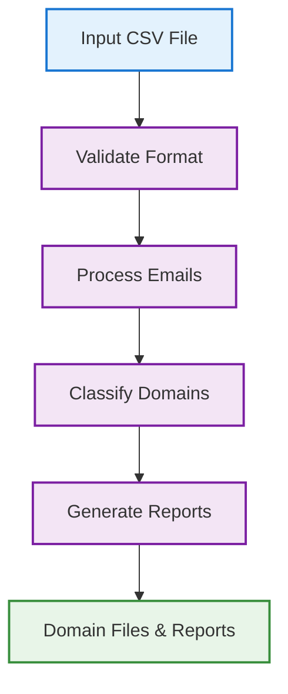

# User Guide

Welcome to the Email Domain Classifier User Guide! This comprehensive guide will help you get started with email classification, from basic usage to advanced features.

## Table of Contents

1. **[Quick Start](quick-start.md)** - Get up and running in 5 minutes
2. **[Usage Examples](usage-examples.md)** - Detailed examples and practical use cases
3. **[CLI Reference](cli-reference.md)** - Complete command-line interface documentation
4. **[Troubleshooting](troubleshooting.md)** - Common issues and solutions

## Getting Started

New to Email Domain Classifier? Start with our [Quick Start Guide](quick-start.md) to:

- Install the classifier
- Run your first classification
- Understand the basic workflow
- View your results

## Key Concepts

### Dual-Method Classification

The classifier uses two complementary methods for maximum accuracy:

1. **Keyword Taxonomy Matching** - Analyzes domain-specific keywords, sender patterns, and subject patterns
2. **Structural Template Matching** - Evaluates email structure, formality, and content patterns

**Emails are only classified when both methods agree**, ensuring high-confidence results.

### Supported Domains

| Domain | Icon | Description | Common Examples |
|--------|-------|-------------|-----------------|
| **Finance** | 💰 | Banking, payments, financial services | Bank statements, payment confirmations |
| **Technology** | 💻 | Software, hardware, IT services | Software updates, tech support |
| **Retail** | 🛒 | E-commerce, shopping, consumer goods | Order confirmations, shopping receipts |
| **Logistics** | 📦 | Shipping, supply chain, transportation | Delivery notifications, tracking |
| **Healthcare** | 🏥 | Medical services, health insurance | Appointment reminders, insurance claims |
| **Government** | 🏛️ | Public sector, regulatory agencies | Tax notices, official communications |
| **HR** | 👥 | Human resources, recruitment, employee services | Job applications, HR notifications |
| **Telecommunications** | 📞 | Phone, internet, communication services | Bill notifications, service updates |
| **Social Media** | 📱 | Social platforms, networking services | Notifications, activity updates |
| **Education** | 🎓 | Schools, universities, learning platforms | Course materials, academic notices |

## Workflow Overview



## Input Data Requirements

Your CSV file must contain these columns:

| Column | Type | Description | Example |
|--------|------|-------------|---------|
| `sender` | string | Email sender address | `security@bank.com` |
| `receiver` | string | Email recipient address | `user@company.com` |
| `timestamp` | string | Email timestamp | `2024-01-15 10:30:00` |
| `subject` | string | Email subject line | `Your account statement is ready` |
| `body` | string | Email body content | `Dear Customer, Your monthly statement...` |
| `has_url` | boolean/string | Whether email contains URLs | `true`, `false`, `1`, `0` |

## Output Files

The classifier creates organized output files:

```
output/
├── email_finance.csv          # Finance domain emails
├── email_technology.csv       # Technology domain emails
├── email_retail.csv           # Retail domain emails
├── ...                       # Other domain files
├── email_unsure.csv           # Unclassified emails
├── classification.log         # Detailed processing log
├── classification_report.json  # Machine-readable report
└── classification_report.txt  # Human-readable report
```

## Related Topics

- [Quick Start Guide](quick-start.md) - Get started immediately
- [CLI Reference](cli-reference.md) - All command-line options
- [API Documentation](../api/) - Python integration
- [Troubleshooting](troubleshooting.md) - Solve common problems

## Need Help?

- **Check our [Troubleshooting Guide](troubleshooting.md)**
- **Search existing [GitHub Issues](https://github.com/luongnv89/email-classifier/issues)**
- **Ask in [GitHub Discussions](https://github.com/luongnv89/email-classifier/discussions)**
- **Contact us**: research@montimage.com